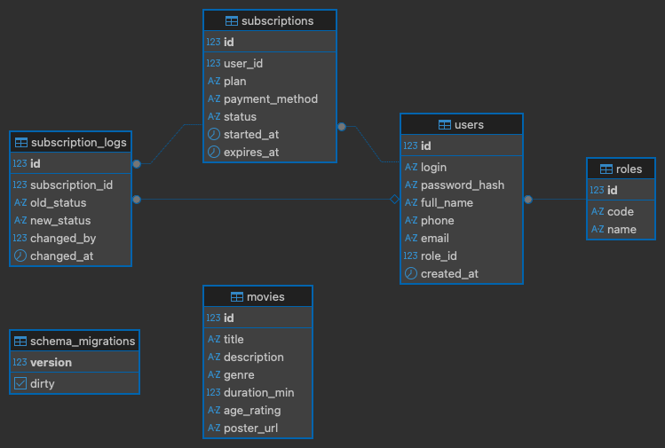

# Онлайн-кинотеатр

Информационная система для просмотра каталога фильмов и управления подписками.

## Стек технологий

| Компонент | Технология |
|---|---|
| Бэкенд | Go 1.26, Gin, sqlx |
| База данных | PostgreSQL |
| Миграции | golang-migrate |
| Авторизация | JWT |
| Хэширование паролей | bcrypt |
| Фронтенд | Next.js 16, TypeScript, Tailwind CSS |

## Сущности базы данных

**roles** — роли пользователей (admin, user)

**users** — пользователи системы: логин, пароль, ФИО, телефон, email, роль

**movies** — каталог фильмов: название, описание, жанр, длительность, возрастной рейтинг, постер

**subscriptions** — подписки пользователей: тариф, способ оплаты, статус, период действия

**subscription_logs** — журнал смены статусов подписок

### Статусы подписки

| Статус | Описание |
|---|---|
| new | Новая — оформлена, ожидает активации |
| active | Активна — действует |
| expired | Истекла — срок действия закончился |
| cancelled | Отменена |

### ER-диаграмма



## API

### Публичные эндпоинты
| Метод | Путь | Описание |
|---|---|---|
| POST | /api/auth/register | Регистрация |
| POST | /api/auth/login | Вход, возвращает JWT |
| GET | /api/movies | Каталог фильмов (фильтры: `?genre=`, `?search=`) |
| GET | /api/movies/:id | Страница фильма |
| GET | /api/genres | Список жанров |

### Пользователь (JWT)
| Метод | Путь | Описание |
|---|---|---|
| GET | /api/user/subscriptions | Список своих подписок |
| POST | /api/user/subscriptions | Оформить подписку |
| PATCH | /api/user/subscriptions/upgrade | Сменить тариф |
| GET | /api/user/subscription/active | Активная подписка |

### Администратор (JWT + роль admin)
| Метод | Путь | Описание |
|---|---|---|
| GET | /api/admin/subscriptions | Все подписки с фильтрацией и пагинацией |
| PATCH | /api/admin/subscriptions/:id/status | Изменить статус |

## Страницы

| Страница | Путь | Доступ |
|---|---|---|
| Главная со слайдером | `/` | Все |
| Каталог фильмов | `/movies` | Все |
| Страница фильма | `/movies/:id` | Все |
| Вход | `/login` | Неавторизованные |
| Регистрация | `/register` | Неавторизованные |
| Кабинет пользователя | `/dashboard` | Авторизованные |
| Панель администратора | `/admin` | Только admin |

## Запуск

### Требования
- Go 1.26+
- Node.js 20+
- PostgreSQL (база данных `online_cinema`)

### Настройка окружения

Необходимо создать `backend/.env` на основе `backend/.env.example`:

```
DB_HOST=localhost
DB_PORT=5432
DB_USER=postgres
DB_PASSWORD=postgres
DB_NAME=online_cinema
JWT_SECRET=your_secret_key
SERVER_PORT=8080
```

### Бэкенд

```bash
cd backend
go run cmd/api/main.go
```

При первом запуске автоматически применяются миграции и тестовые данные. Бэкенд запускается на `http://localhost:8080`.

### Фронтенд

```bash
cd frontend
npm install
npm run dev
```

Фронтенд запускается на `http://localhost:3000`.

## Тестовые учётные записи

| Роль | Логин | Пароль |
|---|---|---|
| Администратор | admin | admin123 |
| Пользователь | user1 | admin123 |

## Сценарии использования

1. **Гость** — просматривает главную, каталог фильмов, страницы фильмов
2. **Регистрация** — `/register` → форма с валидацией → переход на `/login`
3. **Вход** — `/login` → редирект на `/dashboard` (пользователь) или `/admin` (администратор)
4. **Пользователь** — оформляет подписку, меняет тариф, смотрит историю
5. **Страница фильма** — без подписки предлагает оформить, с подпиской показывает плеер
6. **Администратор** — управляет подписками, меняет статусы, фильтрует и листает страницы

## Этапы разработки

| Модуль | Тег | Описание |
|---|---|---|
| 1. Проектирование БД | v0.1.0 | Схема БД, регистрация, авторизация, CRUD подписок |
| 2. Дизайн | v0.2.0 | Тёмная тема, слайдер, адаптив 390×844, Lighthouse 94/95/100/100 |
| 3. Функционал | v0.3.0 | Каталог фильмов, страница фильма, индексы, микроанимации |